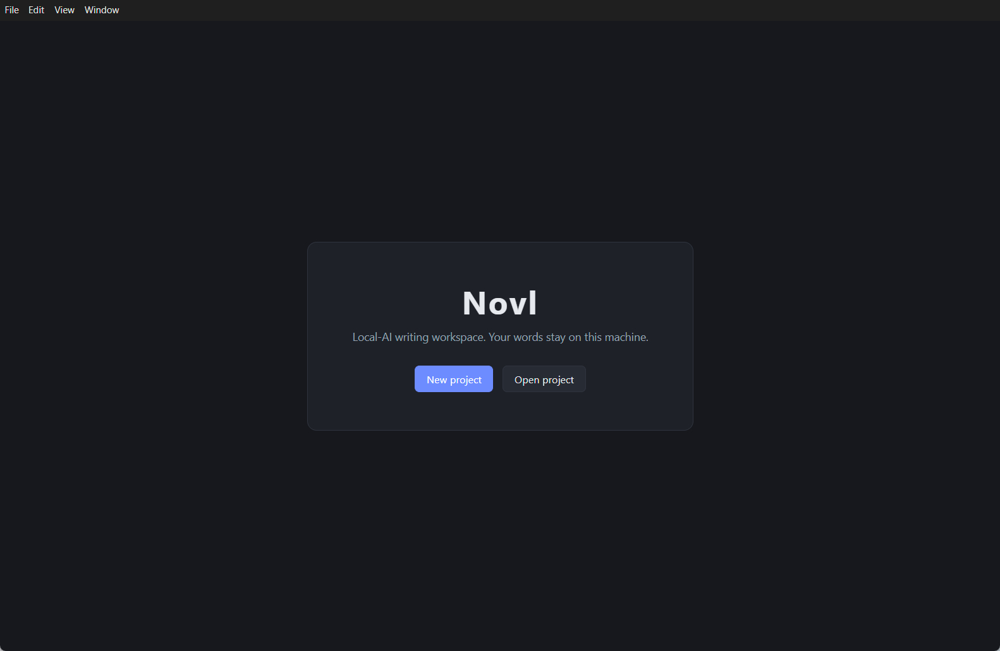
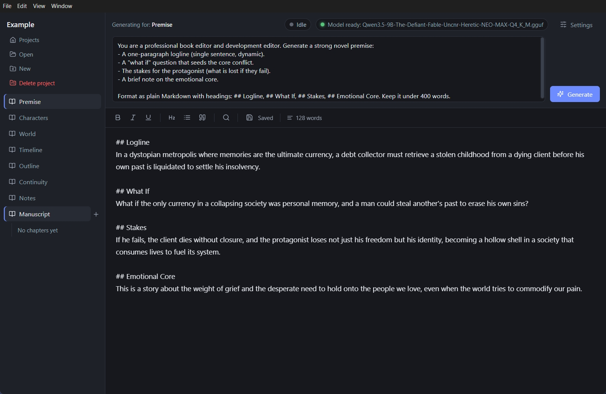
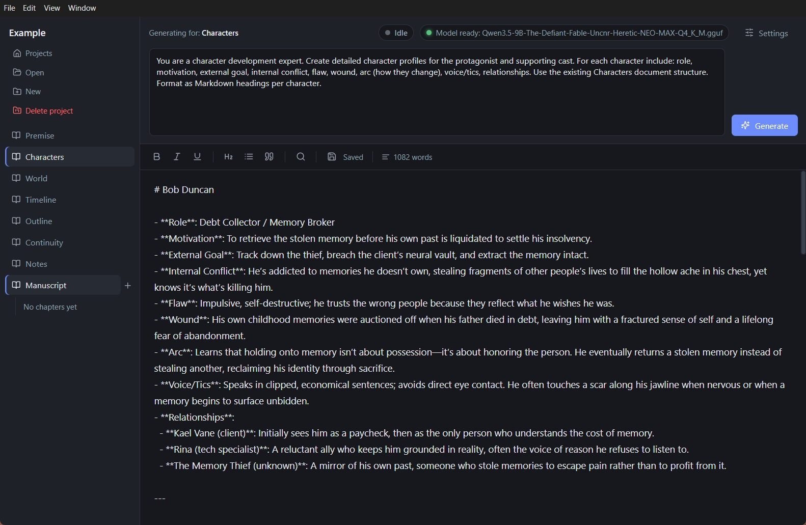
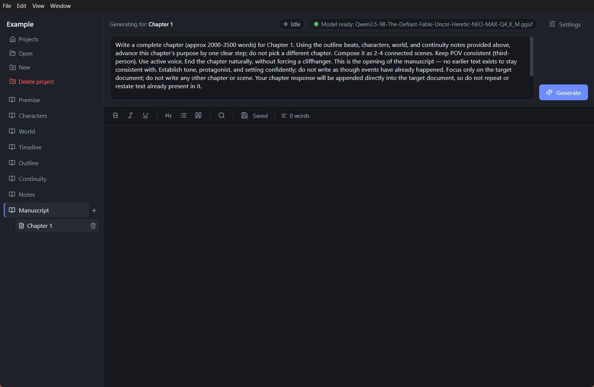

# Novl

**Write short stories and full novels with less effort, and nothing leaves your machine.**

Novl is a local, offline AI writing app built for fiction. Plan your chapters, track characters and worldbuilding as you go, and use the built-in AI to generate drafts, continuations, and rewrites, all from a clean markdown editor. No accounts, no cloud, no telemetry: every word is generated on your own hardware.

It's also a genuinely lighter alternative to today's AI writing apps. Designed for the midrange, more affordable laptops and mini PCs most writers actually own, Novl has no GPU requirement and generates comfortably on CPU alone, on machines where many comparable apps won't even run.

> Developed and tested on **AMD Ryzen with no discrete graphics card** (integrated Radeon only).

## Screenshots

| | |
|---|---|
|  |  |
|  |  |

## Features

- **Projects & documents:** organize your writing into projects, categories, and chapters stored in plain files.
- **Local AI assistant:** generate and rewrite text through a bundled `llama-server` binary; prompts, reference docs, and persona instructions are all composed locally.
- **Markdown editor:** full editor with formatting built in.
- **Find tool:** in-editor find with highlighted matches.
- **Bring your own model:** point Novl at any GGUF model in the settings window; no lock-in to a hosted service.
- **Portable:** the Windows build is fully self-contained (`win-unpacked`); no installer required.

## Requirements

- **OS:** Windows 10/11 (x64)
- **RAM:** 8 GB minimum, 16 GB recommended (the bundled 9B Q4 model uses ~10 GB when generating)
- **GPU:** none required, CPU inference (see compatibility note below)
- **Disc space:** ~1.5 GB for the app plus model files

### Hardware compatibility

The bundled inference backend is tuned for **AMD Ryzen CPUs (Zen 4 / AVX-512)** and runs on CPU only.

- ✅ Works: AMD Ryzen and most modern Intel/AMD laptops and mini PCs, even with integrated graphics only
- ⚠️ Not tested / not required: discrete GPUs, NVIDIA CUDA, AMD Vulkan, the app does not depend on them
- ℹ️ On small RAM (8 GB) use a 1–3B parameter model to avoid heavy swap

## Getting started

1. Download the latest release (`novl-<version>-win32-x64.zip`).
2. Unzip anywhere and run `novl.exe`.
3. Download an LLM from **Hugging Face** yourself. Pick any GGUF file, e.g. a Qwen 3.5 1B/9B Q4 quant (the recommended tested model is a 9B Q4_K_M quant, running in ~16–100 s per generation on a Ryzen 7 7840HS).
4. Open **Settings** and use the **Browse** button to select the `.gguf` file you downloaded.
5. Create a project, add a document, and start writing. Use the AI box to ask for continuations, rewrites, or outline help.

Models are kept in plain `.gguf` files; any GGUF that works with `llama.cpp` should work here. Novl does not bundle a model. The app is the tool, and you bring the model that fits your hardware and taste.

## Building from source

```bash
npm install
npm run typecheck
npm run build
```

The app expects a `llama-server` binary at runtime:

- **Dev:** place `llama-server.exe` (+ DLLs) in `backend/`.
- **Packaged:** binaries are copied to `resources/llama-server/` during the release build.

## Project layout

```text
src/
  main/        Electron main process (IPC, project files, llama-server client)
  preload/     Renderer bridge
  renderer/    React UI (editor, project sidebar, AI panel, settings)
  shared/      Types shared between processes
backend/       llama-server runtime binaries (dev), bundled into releases
```

## Release builds

```text
dist/win-unpacked/   Fully self-contained portable app (what you ship as a zip)
```

## Roadmap

- [ ] **Built-in Hugging Face GGUF search and download:** find and download models without leaving the app.
- [ ] **AI-based grammar check tool:** sentence-level grammar, spelling, and style suggestions powered by the local model.
- [ ] **Online dictionary tool:** word definitions, synonyms, and usage examples in one click.
- [ ] **"AI-written" pattern checker:** a programmatic (non-AI) scan for repetitive phrasing and cadence that reads as generated text, so you can edit it back toward a human voice.

## Acknowledgments

- **[Recall](https://github.com/raiyanyahya/recall)** by **Raiyan Yahya**. Its token-free local summarizer (TF-IDF + TextRank) was ported and used to condense reference documents into a compact context before each generation.
- **ik_llama.cpp ([ikawrakow](https://github.com/ikawrakow/ik_llama.cpp), build 5311, commit `01165d82`, Clang 19.1.5)**. The CPU inference backend Novl uses to power offline generation on Zen 4 / AVX-512 hardware.

## Contributing

Issues and pull requests are welcome. This project is small and community-driven, and every contribution helps.

**Reporting a bug or asking for a feature:** open an [issue](https://github.com/peppersgc/Novl/issues) and describe what you expected versus what happened (bugs), or what you'd like the app to do (feature requests). Screenshots, steps to reproduce, and your hardware setup are always helpful.

**Submitting code (pull requests):**

1. Fork the repository on GitHub.
2. Clone your fork locally and create a feature branch (`git checkout -b my-feature`).
3. Make your changes. For UI/logic in type-safe code, run `npm run typecheck` before committing.
4. Commit and push your branch, then open a pull request against `main` describing what you changed and why.

Keep the scope of a PR focused on one change. It makes review faster and easier to merge.

## License

MIT. See [LICENSE](LICENSE).